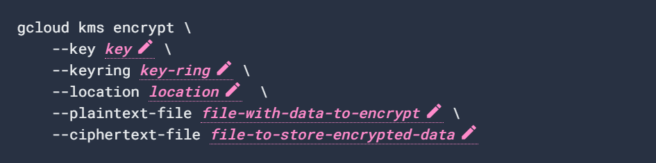
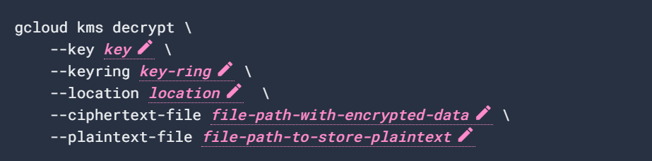

# Cloud Key Management Service - KMS

## Overview
Cloud Key Management Service allows you to create, import, and manage cryptographic keys and perform cryptographic operations in a single centralized cloud service. You can use these keys and perform these operations by using Cloud KMS directly, by using Cloud HSM or Cloud External Key Manager, or by using Customer-Managed Encryption Keys (CMEK) integrations within other Google Cloud services.

With Cloud KMS you are the ultimate custodian of your data, you can manage cryptographic keys in the cloud in the same ways you do on-premises, and you have a provable and monitorable root of trust over your data.
## List of CMEK-integrated services
- A Customer-managed encryption key (CMEK) integration lets you encrypt data at rest in that service using a Cloud KMS key that you own and manage. Data protected with a CMEK key cannot be decrypted without access to that key.

- A CMEK-compliant service either does not store data, or only stores data for a short period of time, such as during batch processing. Such data is encrypted using an ephemeral key that exists only in memory and is never written to disk. When the data is no longer needed, the ephemeral key is flushed from memory, and the data can't ever be accessed again. The output of a CMEK-compliant service might be stored in a service that is integrated with CMEK, such as Cloud Storage.

- Your applications can use Cloud KMS in other ways. For example, you can directly encrypt application data before transmitting or storing it.

**The following table lists services that integrate with Cloud KMS for software and hardware (HSM) keys.** 
| **Service**                                    | **Protected with CMEK**            | **Topic**                                                                                                                                |
|------------------------------------------ |------------------------------ |------------------------------------------------------------------------------------------------------------------------------------ |
| AI Platform Training                       | Data on VM disks               | [Using customer-managed encryption keys](https://cloud.google.com/ai-platform/training/docs/cmek)                                    |
| Artifact Registry                          | Data in repositories           | [Enabling customer-managed encryption keys](https://cloud.google.com/artifact-registry/docs/cmek)                                    |
| BigQuery                                   | Data in BigQuery               | [Protecting data with Cloud KMS keys](https://cloud.google.com/bigquery/docs/customer-managed-encryption)                            |
| Cloud Bigtable                             | Data at rest                   | [Customer-managed encryption keys (CMEK)](https://cloud.google.com/bigtable/docs/cmek)                                               |
| Cloud Composer                             | Environment data               | [Using customer-managed encryption keys](https://cloud.google.com/composer/docs/cmek)                                                |
| Cloud Data Fusion                          | Environment data               | [Using customer-managed encryption keys](https://cloud.google.com/data-fusion/docs/how-to/customer-managed-encryption-keys)          |
| Cloud Functions                            | Data in Cloud Functions        | [Using customer-managed encryption keys](https://cloud.google.com/functions/docs/securing/cmek)                                      |
| Cloud Logging                              | Data in the Log Router         | [Manage the keys that protect Log Router data](https://cloud.google.com/logging/docs/routing/managed-encryption)                     |
| Cloud Logging                              | Data in Logging storage        | [Manage the keys that protect Logging storage data](https://cloud.google.com/logging/docs/routing/managed-encryption-storage)        |
| Cloud Run                                  | Container image                | [Using customer-managed encryption keys with Cloud Run](https://cloud.google.com/run/docs/securing/using-cmek)                       |
| Cloud Spanner                              | Data at rest                   | [Customer-managed encryption keys (CMEK)](https://cloud.google.com/spanner/docs/cmek)                                                |
| Cloud SQL                                  | Data written to databases      | [Using customer-managed encryption keys](https://cloud.google.com/sql/docs/mysql/configure-cmek)                                     |
| Cloud Storage                              | Data in storage buckets        | [Using customer-managed encryption keys](https://cloud.google.com/storage/docs/encryption/using-customer-managed-keys)               |
| Compute Engine                             | Data on VM disks               | [Protecting resources with Cloud KMS keys](https://cloud.google.com/compute/docs/disks/customer-managed-encryption)                  |
| Database Migration Service                 | Data written to databases      | [Using customer-managed encryption keys (CMEK)](https://cloud.google.com/sql/docs/mysql/configure-cmek)                              |
| Dataflow                                   | Pipeline state data            | [Using customer-managed encryption keys](https://cloud.google.com/dataflow/docs/guides/customer-managed-encryption-keys)             |
| Dataproc                                   | Data on VM disks               | [Customer-managed encryption keys](https://cloud.google.com/dataproc/docs/concepts/configuring-clusters/customer-managed-encryption) |
| Dataproc Metastore                         | Data at rest                   | [Using customer-managed encryption keys](https://cloud.google.com/dataproc-metastore/docs/cmek)                                      |
| Datastream                                 | Data in transit                | [Using customer-managed encryption keys (CMEK)](https://cloud.google.com/datastream/docs/use-cmek)                                   |
| Dialogflow CX                              | Data at rest                   | [Customer-managed encryption keys (CMEK)](https://cloud.google.com/dialogflow/cx/docs/concept/cmek)                                  |
| Document AI                                | Data at rest and data in use   | [Customer-managed encryption keys (CMEK)](https://cloud.google.com/document-ai/docs/cmek)                                            |
| Eventarc                                   | Data at rest                   | [Use customer-managed encryption keys (CMEK)](https://cloud.google.com/eventarc/docs/use-cmek)                                       |
| Filestore                                  | Data at rest                   | [Encrypt data with customer-managed encryption keys](https://cloud.google.com/filestore/docs/cmek)                                   |
| Google Distributed Cloud Edge              | Data on Edge nodes             | [Local storage security](https://cloud.google.com/distributed-cloud/edge/latest/docs/security#storage)                               |
| Google Kubernetes Engine                   | Data on VM disks               | [Using customer-managed encryption keys (CMEK)](https://cloud.google.com/kubernetes-engine/docs/how-to/using-cmek)                   |
| Google Kubernetes Engine                   | Application-layer Secrets      | [Application-layer Secrets encryption](https://cloud.google.com/kubernetes-engine/docs/how-to/encrypting-secrets)                    |
| Memorystore for Redis                      | Data at rest                   | [Customer-managed encryption keys (CMEK)](https://cloud.google.com/memorystore/docs/redis/cmek)                                      |
| Pub/Sub                                    | Data associated with topics    | [Configuring message encryption](https://cloud.google.com/pubsub/docs/cmek)                                                          |
| Secret Manager                             | Secret payloads                | [Enabling Customer-Managed Encryption Keys (CMEK)](https://cloud.google.com/secret-manager/docs/cmek)                                |
| Speaker ID (Restricted GA)                 | Data at rest                   | Using customer-managed encryption keys                                                                                               |
| Vertex AI                                  | Data associated with resources | [Using customer-managed encryption keys](https://cloud.google.com/ai-platform-unified/docs/general/cmek)                             |
| Vertex AI Workbench managed notebooks      | User data at rest              | [Customer-managed encryption keys](https://cloud.google.com/vertex-ai/docs/workbench/managed/cmek)                                   |
| Vertex AI Workbench user-managed notebooks | Data on VM disks               | [Customer-managed encryption keys](https://cloud.google.com/vertex-ai/docs/workbench/user-managed/cmek)                              |

## Encrypting data manually using CLI

Replace key with the name of the `key` to use for encryption. Replace `key-ring` with the name of the key ring where the key is located. Replace `location` with the Cloud KMS location for the key ring. Replace `file-with-data-to-encrypt` and `file-to-store-encrypted-data` with the local file paths for reading the plaintext data and saving the encrypted output.

For information on all flags and possible values, run the command with the `--help` flag.

## Decrypting data manually using CLI

Replace key with the name of the `key` to use for decryption. Replace `key-ring` with the name of the key ring where the key will be located. Replace `location` with the Cloud KMS location for the key ring. Replace `file-path-with-encrypted-data` and `file-path-to-store-plaintext` with the local file paths for reading the encrypted data and saving the decrypted output.

For information on all flags and possible values, run the command with the `--help` flag.

## Why to rotate Keys?

For symmetric encryption, periodically and automatically rotating keys is a recommended security practice. Some industry standards, such as [Payment Card Industry Data Security Standard (PCI DSS)](https://www.pcisecuritystandards.org/document_library?category=pcidss&document=pci_dss&utm_source=cloud.google.com&utm_medium=referral), require the regular rotation of keys.

Cloud Key Management Service does not support automatic rotation of asymmetric keys. [See Considerations for asymmetric keys](https://cloud.google.com/kms/docs/key-rotation#asymmetric) below.

Rotating keys provides several benefits:

Limiting the number of messages encrypted with the same key version helps prevent attacks enabled by cryptanalysis. Key lifetime recommendations depend on the key's algorithm, as well as either the number of messages produced or the total number of bytes encrypted with the same key version. For example, the recommended key lifetime for symmetric encryption keys in Galois/Counter Mode (GCM) is based on the number of messages encrypted, as noted at https://nvlpubs.nist.gov/nistpubs/Legacy/SP/nistspecialpublication800-38d.pdf.

In the event that a key is compromised, regular rotation limits the number of actual messages vulnerable to compromise.

If you suspect that a key version is compromised, [disable](https://cloud.google.com/kms/docs/enable-disable) it and [revoke access](https://cloud.google.com/kms/docs/iam) to it as soon as possible.

Regular key rotation ensures that your system is resilient to manual rotation, whether due to a security breach or the need to migrate your application to a stronger cryptographic algorithm. Validate your key rotation procedures before a real-life security incident occurs.

You can also manually rotate a key, either because it is compromised, or to modify your application to use a different algorithm.

## How often to rotate keys?

We recommend that you rotate keys automatically on a regular schedule. A rotation schedule defines the frequency of rotation, and optionally the date and time when the first rotation occurs. The rotation schedule can be based on either the key's age or the number or volume of messages encrypted with a key version.

Some security regulations require periodic, automatic key rotation. Automatic key rotation at a defined period, such as every 90 days, increases security with minimal administrative complexity.

You should also manually rotate a key if you suspect that it has been compromised, or when security guidelines require you to migrate an application to a stronger key algorithm. You can schedule a manual rotation for a date and time in the future. Manually rotating a key does not pause, modify, or otherwise impact an existing automatic rotation schedule for the key.

**Note:** When you rotate a key, data encrypted with previous key versions is not automatically re-encrypted with the new key version.
Do not rely on irregular or manual rotation as a primary component of your application's security.

## Considerations for asymmetric keys

Cloud KMS does not support automatic rotation for asymmetric keys, because additional steps are required before you can use the new asymmetric key version.

- For asymmetric keys used for signing, you must distribute the public key portion of the new key version. Afterward, you can specify the new key version in calls to the `CryptoKeyVersions.asymmetricSign` method to create a signature, and update applications to use the new key version.

- For asymmetric keys used for encryption, you must distribute and incorporate the public portion of the new key version into applications that encrypt data, and grant access to the private portion of the new key version, for applications that decrypt data.

## Rotating keys and re-encrypting data requires the following roles or permissions:

| Permission | 	Default role | Purpose |
| ---------- | -------------- | ------- |
| cloudkms.cryptoKeys.update | Cloud KMS Admin |

------------------------------------------------------------------------------------------------------------------------------------------------------------------------------------------------------------------------------------------------------------------------------------------------------------------------------------------------------------------------------------------------------------
Cloud KMS module that allows managing a keyring, zero or more keys in the keyring, and IAM role bindings on individual keys.

The resources/services/activations/deletions that this module will create/trigger are:

- Create a KMS keyring in the provided project
- Create zero or more keys in the keyring
- Create IAM role bindings for owners, encrypters, decrypters

## Inputs

| Name                   | Description                                                                                                                                                                                                                                                      | Type           | Default                         | Required |
| ---------------------- | ---------------------------------------------------------------------------------------------------------------------------------------------------------------------------------------------------------------------------------------------------------------- | -------------- | ------------------------------- | -------- |
| decrypters             | List of comma-separated owners for each key declared in set\_decrypters\_for.                                                                                                                                                                                    | `list(string)` | `[]`                            | no       |
| encrypters             | List of comma-separated owners for each key declared in set\_encrypters\_for.                                                                                                                                                                                    | `list(string)` | `[]`                            | no       |
| key\_algorithm         | The algorithm to use when creating a version based on this template. See the [https://cloud.google.com/kms/docs/reference/rest/v1/CryptoKeyVersionAlgorithm](https://cloud.google.com/kms/docs/reference/rest/v1/CryptoKeyVersionAlgorithm) for possible inputs. | `string`       | `"GOOGLE_SYMMETRIC_ENCRYPTION"` | no       |
| key\_protection\_level | The protection level to use when creating a version based on this template. Default value: "SOFTWARE" Possible values: \["SOFTWARE", "HSM"\]                                                                                                                     | `string`       | `"SOFTWARE"`                    | no       |
| key\_rotation\_period  | n/a                                                                                                                                                                                                                                                              | `string`       | `"100000s"`                     | no       |
| keyring                | Keyring name.                                                                                                                                                                                                                                                    | `string`       | n/a                             | yes      |
| keys                   | Key names.                                                                                                                                                                                                                                                       | `list(string)` | `[]`                            | no       |
| labels                 | Labels, provided as a map                                                                                                                                                                                                                                        | `map(string)`  | `{}`                            | no       |
| location               | Location for the keyring.                                                                                                                                                                                                                                        | `string`       | n/a                             | yes      |
| owners                 | List of comma-separated owners for each key declared in set\_owners\_for.                                                                                                                                                                                        | `list(string)` | `[]`                            | no       |
| prevent\_destroy       | Set the prevent\_destroy lifecycle attribute on keys.                                                                                                                                                                                                            | `bool`         | `true`                          | no       |
| project\_id            | Project id where the keyring will be created.                                                                                                                                                                                                                    | `string`       | n/a                             | yes      |
| purpose                | The immutable purpose of the CryptoKey. Possible values are ENCRYPT\_DECRYPT, ASYMMETRIC\_SIGN, and ASYMMETRIC\_DECRYPT.                                                                                                                                         | `string`       | `"ENCRYPT_DECRYPT"`             | no       |
| set\_decrypters\_for   | Name of keys for which decrypters will be set.                                                                                                                                                                                                                   | `list(string)` | `[]`                            | no       |
| set\_encrypters\_for   | Name of keys for which encrypters will be set.                                                                                                                                                                                                                   | `list(string)` | `[]`                            | no       |
| set\_owners\_for       | Name of keys for which owners will be set.                                                                                                                                                                                                                       | `list(string)` | `[]`                            | no       |

## Outputs
| Name              | Description                       |
| ----------------- | --------------------------------- |
| keyring           | Self link of the keyring.         |
| keyring\_name     | Name of the keyring.              |
| keyring\_resource | Keyring resource.                 |
| keys              | Map of key name => key self link. |

## Principle of least privilege
To practice the principle of least privilege, grant the most limited set of permissions to the lowest object in the resource hierarchy.

- To grant a principal permissions to encrypt (but not decrypt) data, grant the **roles/cloudkms.cryptoKeyEncrypter** role on the key.

- To grant a principal permissions to encrypt and decrypt data, grant the **roles/cloudkms.cryptoKeyEncrypterDecrypter** role on the key.

- To grant a principal permissions to verify (but not sign) data, grant the **roles/cloudkms.publicKeyViewer** role on the key.

- To grant a principal permissions to sign and verify data, grant the **roles/cloudkms.signerVerifier role** on the key.

- To grant a principal permissions to manage a key, grant the **roles/cloudkms.admin** role on the key.

## Member declaration for Roles:
- **user:{emailid}:** An email address that represents a specific Google account. For example, jane@example.com or joe@example.com.
- **serviceAccount:** {emailid}: An email address that represents a service account. For example, my-other-app@appspot.gserviceaccount.com.
- **group:{emailid}:** An email address that represents a Google group. For example, admins@example.com.
- **domain:{domain}:** A G Suite domain (primary, instead of alias) name that represents all the users of that domain. For example, google.com or example.com.

